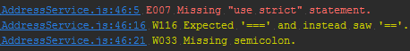

# jshint-practical

> Practical reporter for [JSHint](https://github.com/jshint/jshint)

Not as stylish as the more commonly used [jshint-stylish](https://github.com/sindresorhus/jshint-stylish), but more practical when used in combination with your favorite IDE or editor.

Installation and usage is the same as [jshint-stylish](https://github.com/sindresorhus/jshint-stylish).

Most popular editors like Sublime Text and WebStorm support the 'file:line number:position' formatting so you can quickly navigate to the problem area by copying/pasting.

IntelliJ (and probably WebStorm) go a step further. This is IntelliJ running gulp-jshint with the jshint-practical reporter:  
  
It recognizes the file, line number and position so you can instantly go to the location of the problem with 1 click.